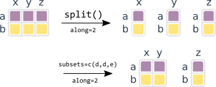
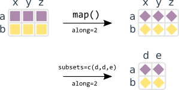

narray :: Array and Matrix processing
=====================================

[](https://cran.r-project.org/package=narray)
[](https://travis-ci.org/mschubert/narray)
[](http://cran.rstudio.com/web/packages/narray/index.html)

This package provides consistent utility functions for array programming with
arbitrary dimensions (summary below).

We recommend to reference functions using the package namespace or
loading the package into its own namespace to not shadow base R
functions. The latter can be done using [`modules`](https://github.com/klmr/modules) or
[`import`](https://github.com/smbache/import).

```r
# example referencing the package namespace
narray::stack(...)

# example using `modules`
ar = modules::import_package('narray')
ar$stack(...)
```

Stacking and splitting
----------------------

`stack()` is like `cbind`/`rbind`, but along arbitrary axes, and taking care of (1) names 
along each dimension and (2) padding partial matching arrays.


```r
A = matrix(1:4, nrow=2, ncol=2, dimnames=list(c('a','b'),c('x','y')))
B = matrix(5:6, nrow=2, ncol=1, dimnames=list(c('b','a'),'z'))

C = stack(A, B, along=2)
#    x y z
#  a 1 3 6   # B is stacked correctly according to its names
#  b 2 4 5

D = stack(m=A, n=C, along=3) # we can also introduce new dimensions
# , , m          , , n
#
#   x y  z         x y z
# a 1 3 NA       a 1 3 6
# b 2 4 NA       b 2 4 5
```

`split()` splits an array along a given axis; can do each element or defined subsets.



```r
split(C, along=2, subsets=c('s1','s1','s2'))
# $s1          $s2
#   x y          z   # each subset is split into a separate array
# a 1 3        a 6   # use drop=TRUE to get a vector for s2
# b 2 4        b 5
```

Mapping functions on arrays
---------------------------

Like `apply`, but not reordering array dimensions and allowing to specify 
subsets that the function should be applied on. The function must either return
a vector of the same length as the input (returns matrix of same dimension) or
of length 1 (drops current dimension or returns subsets).



```r
map(C, along=2, function(x) x*2) # return same length vector
#   x y  z
# a 2 6 12
# b 4 8 10

map(C, along=2, mean, subsets=c('s1', 's1', 's2')) # summarize each subset to scalar
#   s1 s2
# a  2  6
# b  3  5

# we can also index multiple arrays using the `lambda` function
dot = function(x, y) sum(x * y)
lambda(~ dot(A, B), along=c(A=1, B=2))
#    z
# a 23   # the same as A %*% B
# b 34
```

Intersecting
------------

Takes a number of arrays, intersects their names along a given dimension,
and returns sub-arrays that match in their names; `intersect_list` takes 
a list of arrays and returns a list of subsets.


```r
E = matrix(1:6, nrow=3, dimnames=list(c('a','b','d'), c('x','y')))
F = matrix(7:9, nrow=3, dimnames=list(c('b','a','c'), 'z'))

intersect(E, F, along=1)
# > E        > F
#   x y        z
# a 1 4      a 8
# b 2 5      b 7
```

Converting to and from `data.frame`s
------------------------------------

`construct()` takes a data frame and a formula specifying dependent (values) and independent
(axes) of the resulting array.


```r
DF = data.frame(k1=rep(letters[1:3],2), k2=rep(letters[24:25],3), v=1:6)[-6,]
construct(v ~ k1 + k2, data=DF)
#   x  y
# a 1  4
# b 5  2
# c 3 NA
```

Masks from factors and lists
----------------------------

Takes either a factor or a list of vectors and creates a binary matrix 
specifying whether each element is present.


```r
G = list(a='e1', b=c('e1','e2'), c='e2')
mask(G)
#      e1    e2
# a  TRUE FALSE
# b  TRUE  TRUE
# c FALSE  TRUE
```
